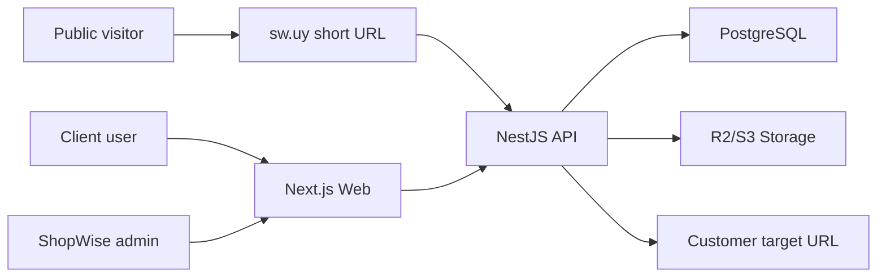

# Architecture

## Recommended Stack

- Monorepo: Turborepo.
- Web: Next.js React app.
- API: NestJS.
- Database: PostgreSQL.
- ORM: Prisma.
- Auth: API-issued JWT with refresh token support for v1.
- Storage: Cloudflare R2 or S3-compatible storage.
- QR generation: `qrcode`.
- Print asset generation: HTML/CSS templates rendered by Playwright or Puppeteer.
- Analytics: internal `DeviceEvent` table first; aggregate tables can be added later.

## Why Not Next.js Fullstack Only

Next.js fullstack is attractive for a smaller SaaS, but ShopWise has backend-heavy workflows: redirect endpoints, device state machines, analytics ingestion, batch generation, asset generation, audit logs, and future integrations. These concerns fit NestJS modules, services, guards, queues, and scheduled jobs better.

## System Context



## Application Boundaries

### `apps/web`

Owns admin/client UI, routing, forms, dashboards, scanner flow, and API client integration.

### `apps/api`

Owns auth, authorization, device lifecycle, public redirect, analytics events, asset generation orchestration, audit logs, and persistence.

### Shared Packages

Use shared packages only for stable contracts and cross-cutting utilities. Avoid sharing business service implementations between frontend and backend.

## Proposed Monorepo Structure

```text
apps/
  web/
    src/
      app/
      components/
      features/
      lib/
  api/
    src/
      modules/
      common/
      prisma/
packages/
  contracts/
    src/
      api/
      dto/
      enums/
  config/
  ui/
  templates/
    sticker/
  utils/
docs/
  adr/
  contracts/
  roadmap/
  specs/
infra/
  docker/
  scripts/
```

## Backend Runtime Shape

- API handles HTTP requests.
- Queue worker can be added for batch asset generation.
- Redis is optional for v1 but recommended once batch generation and rate limiting become heavier.

## Storage Strategy

Store generated files in object storage:

- QR image assets.
- Printable PNG/PDF assets.
- Future product templates.

Database stores metadata and storage keys, not binary files.

